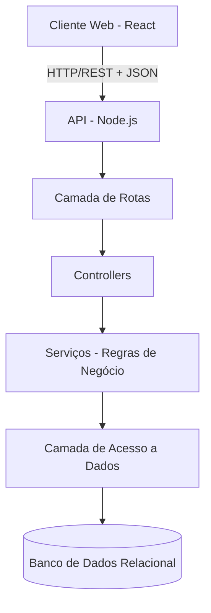
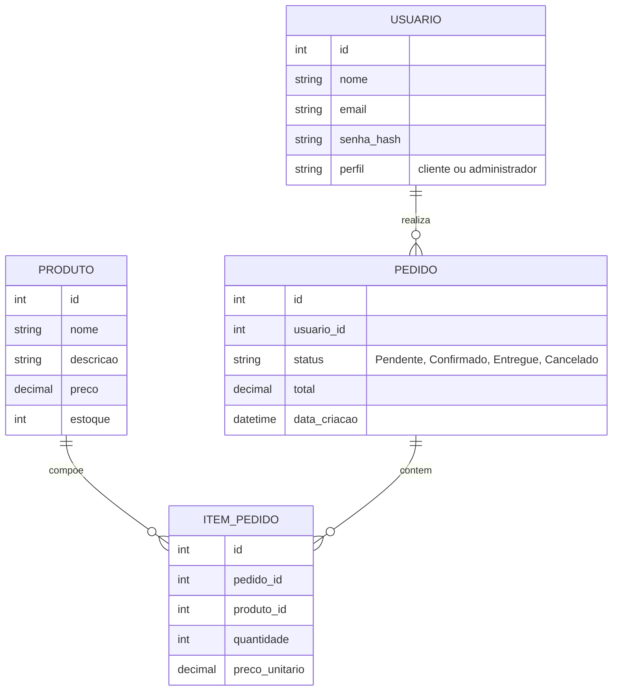

# Documentação do Software — Sistema de Pedidos (Cliente-Servidor)

| Campo | Valor |
|---|---|
| **Versão do documento** | 1.0 |
| **Data** | 18/09/2026 |
| **Autor(es)** | Miguel Moreira |
| **Status** | Rascunho |
| **Aprovado por** | *(a preencher — professor/avaliador da disciplina)* |

## Histórico de Revisões

| Versão | Data | Autor | Descrição da alteração |
|---|---|---|---|
| 1.0 | 18/09/2026 | Miguel Moreira | Criação do documento a partir de levantamento de requisitos |

---

## Sumário

1. [Visão Geral](#1-visão-geral)
2. [Escopo do Projeto](#2-escopo-do-projeto)
3. [Requisitos Funcionais](#3-requisitos-funcionais)
4. [Requisitos Não Funcionais](#4-requisitos-não-funcionais)
5. [Regras de Negócio](#5-regras-de-negócio)
6. [Projeto e Arquitetura do Software](#6-projeto-e-arquitetura-do-software)
7. [Plano e Casos de Teste](#7-plano-e-casos-de-teste)
8. [Matriz de Rastreabilidade](#8-matriz-de-rastreabilidade-requisitos-x-testes-x-código-fonte)
9. [Glossário](#9-glossário)
10. [Anexos e Referências](#10-anexos-e-referências)

---

## 1. Visão Geral

### 1.1 Propósito do documento
Este documento descreve os requisitos, regras de negócio, arquitetura e plano de testes de um **Sistema de Pedidos** com arquitetura **cliente-servidor**, desenvolvido com finalidade acadêmica/didática. Destina-se ao próprio grupo de desenvolvimento e a eventuais avaliadores (professores) do projeto.

### 1.2 Descrição resumida do sistema
Sistema web de pedidos composto por um **cliente** (front-end em **React**, executado no navegador) e um **servidor** (back-end em **Node.js**, expondo uma **API REST**), com persistência em banco de dados **relacional (PostgreSQL/MySQL)**. O sistema possui dois perfis de acesso: **Cliente** (usuário final, que navega pelo catálogo, monta o carrinho e finaliza pedidos com pagamento simulado) e **Administrador** (responsável por gerenciar produtos, processar pedidos e atualizar seus status).

### 1.3 Stakeholders

| Nome / Papel | Responsabilidade | Contato |
|---|---|---|
| Bianca Alves, Beatriz Feitosa, Felipe Penha, Henrique Gonzalez, Matheus Sivero, Miguel Moreira | Desenvolvimento completo do sistema (grupo) — front-end, back-end e documentação | |
| Professor / Avaliador | Avaliação do projeto acadêmico | |
| Cliente (perfil de usuário) | Ator do sistema: navega, compra e acompanha pedidos | |
| Administrador (perfil de usuário) | Ator do sistema: gerencia produtos e pedidos | |

---

## 2. Escopo do Projeto

### 2.1 Objetivos do projeto
- Praticar o desenvolvimento de uma aplicação **cliente-servidor** completa, com front-end e back-end separados se comunicando via API REST.
- Implementar um fluxo de e-commerce simplificado: catálogo → carrinho → checkout (pagamento simulado) → acompanhamento de pedido.
- Praticar conceitos de autenticação, autorização por perfil (cliente/admin) e persistência em banco relacional.
- Servir como material de estudo/portfólio didático do grupo.

### 2.2 Dentro do escopo (In Scope)
**Perfil Cliente:**
- Cadastro de novo usuário cliente *(item identificado como necessário — ver observação ao final da lista)*.
- Login do cliente.
- Visualização do catálogo de produtos.
- Adição, remoção e atualização de quantidade de itens no carrinho.
- Finalização de pedido, com **pagamento simulado** (sem integração com gateway real).
- Consulta ao histórico de pedidos e ao status atual de cada um.
- Cancelamento de pedido, restrito a pedidos ainda no status "Pendente" *(item identificado como necessário — ver observação).*

**Perfil Administrador:**
- Login/autenticação do administrador, com perfil distinto do cliente.
- Gerenciamento de produtos: cadastro, edição e remoção/inativação.
- Controle de estoque (quantidade disponível) por produto.
- Processamento e listagem dos pedidos recebidos.
- Cálculo automático do total do pedido, feito no servidor.
- Atualização do status do pedido (Pendente → Confirmado → Entregue → Cancelado).

> **Observação:** os itens marcados acima como "identificados como necessários" não constavam explicitamente no escopo informado pelo grupo, mas foram adicionados por serem pré-requisitos técnicos ou de consistência para o restante do fluxo funcionar (ex.: não é possível haver "login do cliente" sem uma forma de criar essa conta antes). A lista completa desses itens está resumida na seção 2.6 (Riscos) e detalhada na conversa de entrega deste documento.

### 2.3 Fora do escopo (Out of Scope)
- Integração com gateway de pagamento real (Stripe, PagSeguro, Mercado Pago etc.) — o pagamento é **simulado**.
- Cálculo de frete e integração com transportadoras.
- Aplicativo mobile nativo (o sistema é web/responsivo, se aplicável).
- Recuperação de senha por e-mail (fluxo de "esqueci minha senha") — pode ser tratado em versão futura.
- Notificações por e-mail/SMS sobre mudança de status do pedido.
- Testes automatizados (unitários/integração) — apenas testes manuais, conforme definido pelo grupo.
- Múltiplos administradores com níveis de permissão diferentes (haverá apenas um perfil "admin" genérico).

### 2.4 Premissas
- O grupo possui ambiente com Node.js e um SGBD relacional (PostgreSQL ou MySQL) instalados/configurados para desenvolvimento.
- O sistema será executado em ambiente local/de desenvolvimento, sem necessidade de infraestrutura de produção.
- Haverá conexão de rede local entre cliente (navegador) e servidor (API), mesmo em ambiente de desenvolvimento.
- Os dados cadastrados (usuários, produtos) serão fictícios, sem uso de dados pessoais reais.

### 2.5 Restrições
- Arquitetura obrigatoriamente **cliente-servidor**: front-end (React) e back-end (Node.js/API REST) desacoplados.
- Comunicação entre cliente e servidor via **API REST** (não GraphQL, não WebSocket).
- Banco de dados **relacional** (PostgreSQL ou MySQL).
- Sem testes automatizados; validação por testes manuais roteirizados (seção 7).
- Prazo de entrega vinculado ao cronograma da disciplina acadêmica *(data específica a definir pelo grupo)*.

### 2.6 Riscos identificados

| ID | Risco | Probabilidade | Impacto | Mitigação |
|---|---|---|---|---|
| R-01 | Ausência de testes automatizados pode deixar passar regressões ao alterar o back-end | Média | Médio | Elaborar roteiro de testes manuais (seção 7) e executá-lo a cada alteração relevante |
| R-02 | Cálculo do total do pedido feito de forma inconsistente (ex.: confiar em valor enviado pelo cliente) pode gerar total incorreto ou vulnerabilidade | Média | Alto | Total deve ser **sempre recalculado no servidor** a partir do catálogo (RN-05) |
| R-03 | Falta de controle de estoque no carrinho pode permitir pedidos de produtos indisponíveis | Média | Médio | Validar estoque no momento de adicionar ao carrinho e novamente no checkout (RN-02, RN-03) |
| R-04 | Ausência de fluxo de cadastro de cliente inviabiliza o login (dependência não coberta no escopo original) | Alta | Alto | Incluído como requisito RF-01 nesta documentação |
| R-05 | Cliente ou administrador acessando rotas fora do seu perfil (ex.: cliente chamando endpoint de admin) | Média | Alto | Middleware de autorização por perfil no back-end, validando o token em toda rota protegida (RNF-04) |
| R-06 | Prazo acadêmico apertado pode levar à entrega de funcionalidades incompletas | Média | Médio | Priorizar fluxo principal (login → catálogo → carrinho → checkout → status) antes de itens secundários |

### 2.7 Entregáveis
- Código-fonte do back-end (API REST em Node.js).
- Código-fonte do front-end (aplicação React).
- Script de criação do banco de dados (schema relacional).
- Esta documentação de software.

---

## 3. Requisitos Funcionais

> Requisitos funcionais descrevem **o que** o sistema deve fazer.

### Convenção de ID
`RF-XX` (Requisito Funcional número XX)

### 3.1 Lista de Requisitos Funcionais

| ID | Descrição | Prioridade | Origem / Solicitante | Status |
|---|---|---|---|---|
| RF-01 | O sistema deve permitir o cadastro de um novo usuário cliente (nome, e-mail e senha). | Alta | Identificado como necessário (pré-requisito do login) | A implementar |
| RF-02 | O sistema deve permitir que o cliente realize login com e-mail e senha. | Alta | Grupo | A implementar |
| RF-03 | O sistema deve permitir que o cliente visualize a lista de produtos disponíveis (catálogo). | Alta | Grupo | A implementar |
| RF-04 | O sistema deve permitir que o cliente visualize os detalhes de um produto específico. | Média | Identificado como necessário (complementa RF-03) | A implementar |
| RF-05 | O sistema deve permitir que o cliente adicione produtos ao carrinho de compras. | Alta | Grupo | A implementar |
| RF-06 | O sistema deve permitir que o cliente remova produtos do carrinho ou altere a quantidade de um item. | Alta | Identificado como necessário (complementa o carrinho) | A implementar |
| RF-07 | O sistema deve exibir o carrinho com os itens selecionados e o valor total calculado. | Alta | Grupo | A implementar |
| RF-08 | O sistema deve permitir que o cliente finalize o pedido (checkout), com etapa de **pagamento simulado**. | Alta | Grupo | A implementar |
| RF-09 | O sistema deve permitir que o cliente consulte o histórico de seus pedidos e o status atual de cada um. | Alta | Grupo | A implementar |
| RF-10 | O sistema deve permitir que o cliente cancele um pedido, desde que este esteja com status "Pendente". | Média | Identificado como necessário (contrapartida do status "Cancelado") | A implementar |
| RF-11 | O sistema deve permitir que o administrador realize login/autenticação, com perfil distinto do cliente. | Alta | Grupo | A implementar |
| RF-12 | O sistema deve permitir que o administrador cadastre novos produtos (nome, descrição, preço, estoque). | Alta | Grupo | A implementar |
| RF-13 | O sistema deve permitir que o administrador edite produtos existentes. | Alta | Grupo | A implementar |
| RF-14 | O sistema deve permitir que o administrador remova ou inative produtos. | Média | Grupo | A implementar |
| RF-15 | O sistema deve permitir que o administrador controle o estoque (quantidade disponível) de cada produto. | Alta | Grupo | A implementar |
| RF-16 | O sistema deve permitir que o administrador visualize e processe a lista de pedidos recebidos. | Alta | Grupo | A implementar |
| RF-17 | O sistema deve calcular automaticamente o total do pedido no servidor, a partir dos itens e preços do catálogo. | Alta | Grupo | A implementar |
| RF-18 | O sistema deve permitir que o administrador atualize o status do pedido (Pendente → Confirmado → Entregue → Cancelado). | Alta | Grupo | A implementar |
| RF-19 | O sistema deve restringir o acesso às funcionalidades administrativas apenas a usuários autenticados com perfil "Administrador". | Alta | Identificado como necessário (segurança de perfis) | A implementar |

### 3.2 Detalhamento de Requisitos

#### RF-01 — Cadastro de usuário cliente
- **Descrição:** O sistema deve permitir que um novo cliente crie uma conta informando nome, e-mail e senha.
- **Ator(es):** Cliente (não autenticado)
- **Pré-condições:** E-mail ainda não cadastrado no sistema.
- **Fluxo principal:**
  1. Usuário acessa a tela de cadastro.
  2. Usuário informa nome, e-mail e senha.
  3. Sistema valida os dados e verifica se o e-mail já existe.
  4. Sistema cria a conta com senha armazenada de forma segura (hash).
  5. Sistema confirma o cadastro e direciona para o login.
- **Fluxos alternativos / exceções:**
  - E-mail já cadastrado → sistema exibe mensagem de erro.
  - Senha fora dos critérios mínimos (RN-01) → sistema exibe mensagem de erro.
- **Pós-condições:** Novo usuário cliente criado no banco de dados.
- **Critérios de aceite:**
  - [ ] Cadastro com dados válidos é concluído com sucesso.
  - [ ] Cadastro com e-mail duplicado é rejeitado com mensagem clara.
  - [ ] Senha é armazenada com hash, nunca em texto puro.
- **Requisitos relacionados:** RF-02, RNF-04, RN-01

#### RF-02 — Login do cliente
- **Descrição:** O sistema deve autenticar o cliente a partir de e-mail e senha, retornando um token de sessão (ex.: JWT) com o perfil "cliente".
- **Ator(es):** Cliente
- **Pré-condições:** Cliente previamente cadastrado (RF-01).
- **Fluxo principal:**
  1. Cliente informa e-mail e senha na tela de login.
  2. Sistema valida as credenciais.
  3. Sistema gera e retorna um token de autenticação contendo o perfil do usuário.
  4. Cliente é redirecionado para a página de catálogo.
- **Fluxos alternativos / exceções:**
  - Credenciais inválidas → sistema exibe mensagem de erro, sem indicar se o erro é no e-mail ou na senha.
- **Pós-condições:** Cliente autenticado, com token válido para requisições subsequentes.
- **Critérios de aceite:**
  - [ ] Login com credenciais válidas retorna token e redireciona ao catálogo.
  - [ ] Login com credenciais inválidas é rejeitado com mensagem genérica.
- **Requisitos relacionados:** RF-01, RNF-04

#### RF-05 a RF-07 — Carrinho de compras
- **Descrição:** O sistema deve permitir montar um carrinho com produtos do catálogo, respeitando o estoque disponível, exibindo o total calculado.
- **Ator(es):** Cliente autenticado
- **Pré-condições:** Cliente logado; catálogo com produtos disponíveis.
- **Fluxo principal:**
  1. Cliente seleciona um produto e informa a quantidade desejada.
  2. Sistema valida se há estoque suficiente (RN-02).
  3. Sistema adiciona o item ao carrinho (ou atualiza a quantidade, se já existir).
  4. Sistema recalcula e exibe o total do carrinho.
- **Fluxos alternativos / exceções:**
  - Quantidade solicitada maior que o estoque disponível → sistema exibe mensagem de erro e não adiciona/atualiza o item.
  - Remoção de item → sistema recalcula o total automaticamente.
- **Pós-condições:** Carrinho atualizado com os itens e total correntes.
- **Critérios de aceite:**
  - [ ] Total do carrinho reflete corretamente soma de (preço unitário × quantidade) de todos os itens.
  - [ ] Não é possível adicionar quantidade maior que o estoque disponível.
- **Requisitos relacionados:** RF-15, RN-02, RN-05

#### RF-08 — Finalização de pedido (checkout com pagamento simulado)
- **Descrição:** O sistema deve permitir que o cliente finalize o pedido a partir do carrinho, simulando uma etapa de pagamento (sem integração real).
- **Ator(es):** Cliente autenticado
- **Pré-condições:** Carrinho com ao menos um item.
- **Fluxo principal:**
  1. Cliente confirma o carrinho e avança para o checkout.
  2. Sistema exibe resumo do pedido e total (recalculado no servidor).
  3. Cliente confirma o "pagamento" (simulado — aprovação automática).
  4. Sistema cria o pedido com status inicial "Pendente", associa os itens e decrementa o estoque correspondente (RN-03).
  5. Sistema esvazia o carrinho e exibe confirmação do pedido ao cliente.
- **Fluxos alternativos / exceções:**
  - Algum item do carrinho ficou sem estoque suficiente entre a montagem do carrinho e o checkout → sistema informa o item afetado e impede a finalização até ajuste do carrinho.
- **Pós-condições:** Pedido criado no banco, com status "Pendente"; estoque atualizado.
- **Critérios de aceite:**
  - [ ] Pedido é criado corretamente com os itens, quantidades e total do carrinho.
  - [ ] Estoque dos produtos é decrementado após a finalização.
  - [ ] Falta de estoque de última hora é tratada sem gerar pedido inconsistente.
- **Requisitos relacionados:** RF-05 a RF-07, RF-17, RN-02, RN-03, RN-05, RN-06

#### RF-09 — Consulta de histórico e status de pedidos
- **Descrição:** O sistema deve permitir que o cliente visualize a lista de seus pedidos anteriores, com data, itens, total e status atual.
- **Ator(es):** Cliente autenticado
- **Pré-condições:** Cliente possui ao menos um pedido registrado (ou lista vazia na primeira consulta).
- **Fluxo principal:**
  1. Cliente acessa "Meus pedidos".
  2. Sistema busca e exibe todos os pedidos vinculados ao cliente autenticado.
- **Fluxos alternativos / exceções:**
  - Cliente sem pedidos → sistema exibe mensagem informando que não há pedidos.
- **Pós-condições:** Lista de pedidos exibida ao cliente.
- **Critérios de aceite:**
  - [ ] Cliente só visualiza seus próprios pedidos (nunca de outros clientes).
  - [ ] Status exibido reflete o valor atual no banco de dados.
- **Requisitos relacionados:** RF-18, RNF-04

#### RF-10 — Cancelamento de pedido pelo cliente
- **Descrição:** O sistema deve permitir que o cliente cancele um pedido próprio, desde que ainda esteja no status "Pendente".
- **Ator(es):** Cliente autenticado
- **Pré-condições:** Pedido pertence ao cliente e está com status "Pendente".
- **Fluxo principal:**
  1. Cliente seleciona um pedido pendente em "Meus pedidos".
  2. Cliente confirma o cancelamento.
  3. Sistema atualiza o status do pedido para "Cancelado" e devolve os itens ao estoque.
- **Fluxos alternativos / exceções:**
  - Pedido já não está mais "Pendente" (ex.: já Confirmado/Entregue) → sistema impede o cancelamento e informa o motivo.
- **Pós-condições:** Pedido marcado como "Cancelado"; estoque estornado.
- **Critérios de aceite:**
  - [ ] Cancelamento só é permitido para pedidos "Pendentes".
  - [ ] Estoque dos itens do pedido cancelado é devolvido corretamente.
- **Requisitos relacionados:** RF-18, RN-04, RN-07

#### RF-11 — Login/autenticação do administrador
- **Descrição:** O sistema deve autenticar o administrador com e-mail e senha, retornando um token com o perfil "administrador".
- **Ator(es):** Administrador
- **Pré-condições:** Conta de administrador previamente existente no banco (criada via seed/script, fora do escopo de autoatendimento).
- **Fluxo principal:** Análogo ao RF-02, distinguindo-se pelo perfil retornado no token.
- **Fluxos alternativos / exceções:** Credenciais inválidas → mensagem de erro genérica.
- **Pós-condições:** Administrador autenticado, com token contendo perfil "administrador".
- **Critérios de aceite:**
  - [ ] Token gerado para administrador contém o perfil correto.
  - [ ] Rotas administrativas exigem esse perfil (RF-19).
- **Requisitos relacionados:** RF-19, RNF-04

#### RF-12 a RF-15 — Gerenciamento de produtos e estoque
- **Descrição:** O sistema deve permitir que o administrador cadastre, edite, remova/inative produtos e controle a quantidade em estoque de cada um.
- **Ator(es):** Administrador autenticado
- **Pré-condições:** Administrador logado.
- **Fluxo principal:**
  1. Administrador acessa o painel de produtos.
  2. Administrador cadastra um novo produto (nome, descrição, preço, estoque inicial) ou seleciona um produto existente para editar/remover/ajustar estoque.
  3. Sistema valida os dados e persiste as alterações.
- **Fluxos alternativos / exceções:**
  - Dados obrigatórios ausentes (ex.: preço negativo) → sistema rejeita com mensagem de erro.
  - Tentativa de remover produto já vinculado a pedidos existentes → sistema inativa o produto (não remove fisicamente), preservando o histórico de pedidos.
- **Pós-condições:** Catálogo de produtos atualizado.
- **Critérios de aceite:**
  - [ ] Produto cadastrado aparece corretamente no catálogo do cliente.
  - [ ] Estoque atualizado pelo administrador reflete corretamente nas validações do carrinho.
- **Requisitos relacionados:** RF-03, RF-05, RN-02

#### RF-16 a RF-18 — Processamento de pedidos e atualização de status
- **Descrição:** O sistema deve permitir que o administrador visualize todos os pedidos recebidos e avance o status de cada um, do fluxo Pendente → Confirmado → Entregue, ou marque como Cancelado.
- **Ator(es):** Administrador autenticado
- **Pré-condições:** Existem pedidos registrados no sistema.
- **Fluxo principal:**
  1. Administrador acessa a lista de pedidos.
  2. Administrador seleciona um pedido e altera seu status conforme o fluxo definido.
  3. Sistema valida se a transição de status é permitida (RN-07) e persiste a alteração.
- **Fluxos alternativos / exceções:**
  - Tentativa de transição de status inválida (ex.: de "Entregue" para "Pendente") → sistema rejeita com mensagem de erro.
- **Pós-condições:** Status do pedido atualizado; cliente passa a visualizar o novo status em RF-09.
- **Critérios de aceite:**
  - [ ] Apenas transições de status válidas (RN-07) são aceitas.
  - [ ] Total do pedido (RF-17) é sempre o valor calculado no momento da finalização, não recalculado a cada consulta.
- **Requisitos relacionados:** RF-09, RF-10, RN-04, RN-06, RN-07

#### RF-19 — Restrição de acesso por perfil
- **Descrição:** O sistema deve garantir que rotas administrativas (produtos, processamento de pedidos) só sejam acessíveis a usuários autenticados com perfil "Administrador", e rotas de cliente só a usuários autenticados com perfil "Cliente" quando aplicável.
- **Ator(es):** Sistema (validação automática em cada requisição)
- **Pré-condições:** Requisição chega ao servidor com ou sem token de autenticação.
- **Fluxo principal:**
  1. Sistema intercepta a requisição (middleware de autenticação/autorização).
  2. Sistema valida o token e extrai o perfil do usuário.
  3. Sistema verifica se o perfil tem permissão para a rota solicitada.
  4. Em caso positivo, a requisição prossegue; caso contrário, é rejeitada.
- **Fluxos alternativos / exceções:**
  - Token ausente, inválido ou expirado → sistema retorna erro de não autorizado (HTTP 401).
  - Perfil sem permissão para a rota → sistema retorna erro de acesso proibido (HTTP 403).
- **Pós-condições:** Acesso concedido ou negado conforme o perfil.
- **Critérios de aceite:**
  - [ ] Cliente não consegue acessar rotas administrativas, mesmo autenticado.
  - [ ] Requisições sem token válido são sempre rejeitadas em rotas protegidas.
- **Requisitos relacionados:** RF-02, RF-11, RNF-04

---

## 4. Requisitos Não Funcionais

> Requisitos não funcionais descrevem **como** o sistema deve se comportar. As categorias seguem o modelo de qualidade da **ISO/IEC 25010**, complementado por requisitos de **conformidade legal (LGPD)**.

### Convenção de ID
`RNF-XX` (Requisito Não Funcional número XX)

### 4.1 Lista de Requisitos Não Funcionais

| ID | Característica ISO 25010 | Subcaracterística | Descrição | Critério de aceite / Métrica | Prioridade |
|---|---|---|---|---|---|
| RNF-01 | Eficiência de Desempenho | Comportamento temporal | As requisições à API (listar produtos, carrinho, checkout) devem responder rapidamente em ambiente de desenvolvimento. | Resposta perceptivelmente rápida (< 2s) em ambiente local | Média |
| RNF-02 | Confiabilidade | Tolerância a falhas | O sistema não deve permitir a criação de um pedido em estado inconsistente (ex.: item sem estoque, total divergente). | Nenhuma inconsistência entre pedido criado e estoque/total nos testes da seção 7 | Alta |
| RNF-03 | Usabilidade | Operabilidade | As telas de catálogo, carrinho e checkout devem ser claras o suficiente para uso sem necessidade de manual. | Grupo consegue operar o fluxo completo sem consulta externa | Média |
| RNF-04 | Segurança | Confidencialidade / Autenticidade | Senhas de cliente e administrador devem ser armazenadas com hash (nunca em texto puro); acesso a rotas deve ser controlado por token e perfil. | Uso de biblioteca de hash (ex.: bcrypt) + middleware de autenticação/autorização em todas as rotas protegidas | Alta |
| RNF-05 | Manutenibilidade | Modularidade | O back-end deve ser organizado em camadas (rotas, controllers, serviços, acesso a dados), mesmo sendo uma aplicação única (sem microsserviços). | Estrutura de pastas separando essas responsabilidades | Média |
| RNF-06 | Compatibilidade | Interoperabilidade | A API deve expor endpoints REST em formato JSON, consumíveis pelo front-end React e testáveis por ferramentas externas (ex.: Postman/Insomnia). | Endpoints documentados e testáveis via ferramenta HTTP externa | Média |
| RNF-07 | Portabilidade | Adaptabilidade | O sistema deve poder ser executado em diferentes máquinas de desenvolvimento a partir de variáveis de ambiente (ex.: string de conexão do banco). | Uso de arquivo `.env` para configuração sensível/variável | Média |
| RNF-08 | Adequação Funcional | Corretude | O total do pedido deve sempre corresponder à soma correta dos itens, calculado no servidor — nunca confiando em valor vindo do cliente. | Testes de checkout (seção 7) validam total correto mesmo com manipulação do front-end | Alta |

### 4.2 Conformidade com a LGPD (Lei nº 13.709/2018)

Conforme informado pelo grupo, o sistema utilizará apenas **dados fictícios/genéricos** de usuários (clientes e administrador), sem dados pessoais reais. Por esse motivo, os requisitos RNF-L01 a RNF-L10 do template original **não são obrigatórios** nesta entrega acadêmica.

Ainda assim, como o sistema **estrutural e conceitualmente** trata dados que seriam pessoais em um cenário real (nome, e-mail, senha, endereço/pedido), recomenda-se manter, por boa prática, os seguintes pontos mínimos, já cobertos pelos requisitos funcionais e não funcionais acima:
- Senhas armazenadas com hash, nunca em texto puro (RNF-04).
- Controle de acesso por perfil, evitando que um cliente veja dados de outro (RF-09, RF-19).

Caso o projeto evolua para uso com dados reais de usuários (fora do contexto acadêmico), esta seção deve ser revisitada e os requisitos RNF-L01 a RNF-L10 (finalidade, consentimento, minimização, direitos do titular, segurança e sigilo, retenção, registro de operações, notificação de incidentes, privacy by design, transferência internacional) devem ser reincorporados e detalhados.

---

## 5. Regras de Negócio

> Regras de negócio são políticas, restrições ou lógicas que independem de uma funcionalidade específica.

### Convenção de ID
`RN-XX` (Regra de Negócio número XX)

### 5.1 Lista de Regras de Negócio

| ID | Descrição | Origem | Requisitos relacionados |
|---|---|---|---|
| RN-01 | A senha do usuário (cliente ou administrador) deve ter no mínimo 8 caracteres. | Identificado como necessário | RF-01, RF-11 |
| RN-02 | Não é permitido adicionar ao carrinho, ou finalizar um pedido com, quantidade maior do que o estoque disponível do produto. | Grupo | RF-05, RF-08, RF-15 |
| RN-03 | Ao finalizar um pedido (checkout), o estoque dos produtos envolvidos deve ser decrementado na mesma quantidade solicitada. | Identificado como necessário | RF-08, RF-15 |
| RN-04 | Um pedido só pode ser cancelado pelo cliente enquanto estiver com status "Pendente". | Grupo | RF-10, RF-18 |
| RN-05 | O total do pedido deve ser sempre recalculado no servidor a partir do preço atual dos produtos no catálogo, nunca aceito diretamente do cliente. | Identificado como necessário (segurança/consistência) | RF-07, RF-08, RF-17 |
| RN-06 | O total de um pedido já finalizado é fixado no momento da criação e não deve ser recalculado a partir de mudanças futuras de preço do produto. | Identificado como necessário (consistência histórica) | RF-17, RF-18 |
| RN-07 | O status do pedido deve seguir obrigatoriamente o fluxo: Pendente → Confirmado → Entregue, podendo ser movido para Cancelado apenas a partir de "Pendente". Transições fora dessa ordem não são permitidas. | Grupo | RF-10, RF-18 |
| RN-08 | Ao cancelar um pedido (seja pelo cliente, enquanto pendente, seja excepcionalmente pelo administrador), os itens do pedido devem ter seu estoque devolvido. | Identificado como necessário (consistência de estoque) | RF-10, RF-18 |

---

## 6. Projeto e Arquitetura do Software

### 6.1 Visão arquitetural
Arquitetura **cliente-servidor**, com front-end e back-end desacoplados:
- **Cliente:** Single Page Application em **React**, executada no navegador, consumindo a API do servidor.
- **Servidor:** aplicação **Node.js**, expondo uma **API REST** organizada internamente em camadas (rotas → controllers → serviços → acesso a dados), sem uso de microsserviços — o back-end é uma aplicação única.
- **Persistência:** banco de dados **relacional** (PostgreSQL ou MySQL, a definir pelo grupo).

### 6.2 Diagrama de arquitetura (visão geral)



### 6.3 Componentes / Módulos

| Componente | Responsabilidade | Tecnologia |
|---|---|---|
| Front-end (Cliente) | Interface do cliente e do administrador; consumo da API REST | React |
| API / Back-end | Regras de negócio, autenticação/autorização, orquestração das operações | Node.js |
| Banco de Dados | Persistência de usuários, produtos, pedidos e itens de pedido | PostgreSQL ou MySQL |
| Módulo de Autenticação | Login, geração e validação de token (JWT), controle de perfil (cliente/admin) | Node.js (biblioteca JWT + hash de senha) |
| Módulo de Pagamento Simulado | Simula aprovação de pagamento no checkout, sem gateway real | Node.js (lógica interna) |

### 6.4 Stack tecnológica

| Camada | Tecnologia / Ferramenta | Versão |
|---|---|---|
| Front-end | React | A definir pelo grupo |
| Back-end | Node.js | A definir pelo grupo (recomenda-se LTS) |
| Framework do back-end | A definir (ex.: Express) | — |
| Banco de Dados | PostgreSQL ou MySQL | A definir pelo grupo |
| Autenticação | JWT (JSON Web Token) + hash de senha (ex.: bcrypt) | — |
| CI/CD | Não aplicável (projeto acadêmico, execução local) | — |

### 6.5 Modelo de dados



### 6.6 Decisões de arquitetura (ADR resumido)

| ID | Decisão | Contexto | Alternativas consideradas | Justificativa |
|---|---|---|---|---|
| ADR-01 | Utilizar arquitetura cliente-servidor com API REST | Requisito definido pelo grupo | GraphQL, WebSocket | REST é mais simples de implementar e testar para o escopo acadêmico definido |
| ADR-02 | Utilizar React no front-end | Escolha do grupo | Vue, Angular | Familiaridade do grupo e ampla documentação disponível |
| ADR-03 | Utilizar Node.js no back-end | Escolha do grupo | Java (Spring Boot), Python (Django/Flask) | Escolha do grupo; permite uso de JavaScript/TypeScript em toda a stack |
| ADR-04 | Utilizar banco de dados relacional (PostgreSQL/MySQL) | Necessidade de integridade referencial entre pedidos, itens e produtos | MongoDB (NoSQL) | Dados possuem relacionamento claro (pedido → itens → produtos), favorecendo modelo relacional |
| ADR-05 | Não utilizar testes automatizados | Escolha do grupo, dado o prazo acadêmico | Jest, Supertest | Priorização do desenvolvimento funcional dentro do prazo da disciplina |
| ADR-06 | Recalcular total do pedido sempre no servidor | Risco de manipulação do valor pelo cliente (R-02) | Aceitar total enviado pelo front-end | Garante integridade e corretude do valor cobrado (RN-05, RNF-08) |

### 6.7 Estrutura de pastas do projeto

```
/client (React)
  /src
    /pages
    /components
    /services (chamadas à API)
/server (Node.js)
  /src
    /routes
    /controllers
    /services
    /models (ou /repositories)
    /middlewares (autenticação/autorização)
  /config (conexão com banco, variáveis de ambiente)
/docs
  Documentacao_Sistema_Pedidos.md
```

### 6.8 Integrações externas

| Sistema externo | Finalidade | Protocolo | Observações |
|---|---|---|---|
| *(nenhuma)* | Pagamento é simulado internamente, sem gateway real | — | Ver seção 2.3 (Fora do escopo) |

---

## 7. Plano e Casos de Teste

### 7.1 Estratégia de testes
Testes **manuais**, executados pelo grupo a cada alteração relevante no back-end ou front-end, cobrindo os fluxos principais de ambos os perfis (cliente e administrador) e as regras de negócio críticas (estoque, cálculo de total, transições de status).

### 7.2 Ambientes de teste

| Ambiente | Finalidade | URL / Acesso |
|---|---|---|
| Desenvolvimento (local) | Desenvolvimento e execução dos testes manuais pelo grupo | `localhost` (front-end e back-end) |

### Convenção de ID
`CT-XX` (Caso de Teste número XX)

### 7.3 Casos de Teste

| ID | Requisito relacionado | Descrição / Cenário | Pré-condições | Passos | Resultado esperado | Status |
|---|---|---|---|---|---|---|
| CT-01 | RF-01 | Cadastro de novo cliente com dados válidos | Nenhuma | 1. Acessar cadastro 2. Informar nome, e-mail e senha válidos 3. Submeter | Conta criada com sucesso | A executar |
| CT-02 | RF-01, RN-01 | Cadastro com senha abaixo do mínimo de caracteres | Nenhuma | 1. Acessar cadastro 2. Informar senha com menos de 8 caracteres | Cadastro rejeitado com mensagem de erro | A executar |
| CT-03 | RF-01 | Cadastro com e-mail já existente | Cliente já cadastrado | 1. Repetir cadastro com mesmo e-mail | Cadastro rejeitado, informando e-mail já em uso | A executar |
| CT-04 | RF-02 | Login de cliente com credenciais válidas | Cliente cadastrado | 1. Acessar login 2. Informar e-mail/senha corretos | Login bem-sucedido, token gerado | A executar |
| CT-05 | RF-02 | Login de cliente com senha incorreta | Cliente cadastrado | 1. Acessar login 2. Informar senha incorreta | Mensagem de erro genérica exibida | A executar |
| CT-06 | RF-03, RF-04 | Visualização do catálogo e detalhes de um produto | Produtos cadastrados | 1. Acessar catálogo 2. Selecionar um produto | Lista e detalhes exibidos corretamente | A executar |
| CT-07 | RF-05, RN-02 | Adicionar ao carrinho quantidade dentro do estoque | Produto com estoque disponível | 1. Selecionar produto 2. Informar quantidade ≤ estoque 3. Adicionar ao carrinho | Item adicionado, total do carrinho atualizado | A executar |
| CT-08 | RF-05, RN-02 | Tentar adicionar ao carrinho quantidade maior que o estoque | Produto com estoque limitado | 1. Selecionar produto 2. Informar quantidade > estoque 3. Adicionar ao carrinho | Sistema rejeita, mensagem de estoque insuficiente | A executar |
| CT-09 | RF-06, RF-07 | Remover item do carrinho e verificar recálculo do total | Carrinho com ao menos 2 itens | 1. Remover um item 2. Verificar total | Total recalculado corretamente, sem o item removido | A executar |
| CT-10 | RF-08, RN-03 | Finalizar pedido (checkout) com sucesso | Carrinho com itens dentro do estoque | 1. Ir para checkout 2. Confirmar pagamento simulado | Pedido criado com status "Pendente"; estoque decrementado | A executar |
| CT-11 | RF-08, RN-05 | Tentar manipular total do pedido a partir do front-end/requisição direta | Carrinho válido | 1. Enviar requisição de checkout com total alterado manualmente | Sistema ignora valor enviado e recalcula o total real no servidor | A executar |
| CT-12 | RF-09 | Consulta de histórico de pedidos do cliente | Cliente com pedidos registrados | 1. Acessar "Meus pedidos" | Lista de pedidos do próprio cliente exibida, com status correto | A executar |
| CT-13 | RF-09, RF-19 | Cliente tenta visualizar pedidos de outro cliente | Dois clientes com pedidos distintos | 1. Autenticado como cliente A, tentar acessar pedido do cliente B | Acesso negado | A executar |
| CT-14 | RF-10, RN-04 | Cancelamento de pedido "Pendente" pelo cliente | Pedido do cliente com status "Pendente" | 1. Selecionar pedido pendente 2. Cancelar | Status alterado para "Cancelado"; estoque devolvido (RN-08) | A executar |
| CT-15 | RF-10, RN-04 | Tentar cancelar pedido já "Confirmado" ou "Entregue" | Pedido com status diferente de "Pendente" | 1. Tentar cancelar pedido não pendente | Sistema impede o cancelamento, com mensagem explicativa | A executar |
| CT-16 | RF-11, RF-19 | Login do administrador e acesso a rotas administrativas | Conta de administrador existente | 1. Login como administrador 2. Acessar painel de produtos | Acesso concedido, painel administrativo exibido | A executar |
| CT-17 | RF-19 | Cliente tenta acessar rota administrativa | Cliente autenticado (não admin) | 1. Autenticado como cliente, tentar acessar endpoint de gerenciamento de produtos | Acesso negado (HTTP 403) | A executar |
| CT-18 | RF-12, RF-13, RF-14 | Cadastro, edição e remoção/inativação de produto pelo administrador | Administrador autenticado | 1. Cadastrar produto 2. Editar dados 3. Remover/inativar | Produto refletido corretamente no catálogo em cada etapa | A executar |
| CT-19 | RF-15 | Atualização de estoque pelo administrador | Produto existente | 1. Alterar quantidade em estoque 2. Verificar no carrinho do cliente | Nova quantidade de estoque respeitada nas validações do carrinho | A executar |
| CT-20 | RF-16, RF-18, RN-07 | Avanço correto do status do pedido pelo administrador | Pedido com status "Pendente" | 1. Alterar status para "Confirmado" 2. Depois para "Entregue" | Transições realizadas na ordem correta | A executar |
| CT-21 | RF-18, RN-07 | Tentar transição de status inválida (fora de ordem) | Pedido com status "Entregue" | 1. Tentar alterar status de "Entregue" para "Pendente" | Sistema rejeita a transição inválida | A executar |

---

## 8. Matriz de Rastreabilidade (Requisitos x Testes x Código-fonte)

| Requisito (RF/RNF/RN) | Descrição resumida | Caso(s) de Teste | Arquivo(s) / Módulo de código | Status de implementação | Status de teste |
|---|---|---|---|---|---|
| RF-01 | Cadastro de cliente | CT-01, CT-02, CT-03 | `server/src/controllers/authController.js` | A implementar | Pendente |
| RF-02 | Login do cliente | CT-04, CT-05 | `server/src/controllers/authController.js` | A implementar | Pendente |
| RF-03/RF-04 | Catálogo e detalhes de produto | CT-06 | `server/src/controllers/produtoController.js` | A implementar | Pendente |
| RF-05/RF-06/RF-07 | Carrinho de compras | CT-07, CT-08, CT-09 | `client/src/services/carrinhoService.js` | A implementar | Pendente |
| RF-08 | Checkout (pagamento simulado) | CT-10, CT-11 | `server/src/controllers/pedidoController.js` | A implementar | Pendente |
| RF-09 | Consulta de histórico de pedidos | CT-12, CT-13 | `server/src/controllers/pedidoController.js` | A implementar | Pendente |
| RF-10 | Cancelamento de pedido pelo cliente | CT-14, CT-15 | `server/src/controllers/pedidoController.js` | A implementar | Pendente |
| RF-11 | Login do administrador | CT-16 | `server/src/controllers/authController.js` | A implementar | Pendente |
| RF-12/RF-13/RF-14 | Gerenciamento de produtos | CT-18 | `server/src/controllers/produtoController.js` | A implementar | Pendente |
| RF-15 | Controle de estoque | CT-19 | `server/src/controllers/produtoController.js` | A implementar | Pendente |
| RF-16/RF-17/RF-18 | Processamento e status de pedidos | CT-20, CT-21 | `server/src/controllers/pedidoController.js` | A implementar | Pendente |
| RF-19 | Restrição de acesso por perfil | CT-13, CT-17 | `server/src/middlewares/authMiddleware.js` | A implementar | Pendente |
| RNF-04 | Segurança (hash de senha, token) | CT-01, CT-04, CT-16 | `server/src/middlewares/authMiddleware.js`, `server/src/utils/hash.js` | A implementar | Pendente |
| RNF-08 | Corretude do cálculo do total | CT-11 | `server/src/services/pedidoService.js` | A implementar | Pendente |
| RN-02 | Validação de estoque no carrinho | CT-08 | `server/src/services/carrinhoService.js` | A implementar | Pendente |
| RN-03 | Decremento de estoque no checkout | CT-10 | `server/src/services/pedidoService.js` | A implementar | Pendente |
| RN-04 | Cancelamento restrito a "Pendente" | CT-14, CT-15 | `server/src/services/pedidoService.js` | A implementar | Pendente |
| RN-05 | Total recalculado no servidor | CT-11 | `server/src/services/pedidoService.js` | A implementar | Pendente |
| RN-07 | Fluxo de status obrigatório | CT-20, CT-21 | `server/src/services/pedidoService.js` | A implementar | Pendente |
| RN-08 | Devolução de estoque ao cancelar | CT-14 | `server/src/services/pedidoService.js` | A implementar | Pendente |

**Legenda — Status de implementação:** Não iniciado / Em desenvolvimento / Concluído / Bloqueado
**Legenda — Status de teste:** Pendente / Em execução / Aprovado / Reprovado

---

## 9. Glossário

| Termo | Definição |
|---|---|
| Cliente-servidor | Estilo arquitetural em que um front-end (cliente) e um back-end (servidor) são desenvolvidos e executados separadamente, comunicando-se por rede/API. |
| API REST | Interface de comunicação entre cliente e servidor baseada em requisições HTTP e recursos identificados por URLs, geralmente trocando dados em JSON. |
| JWT (JSON Web Token) | Formato de token usado para autenticação, contendo informações do usuário (ex.: perfil) de forma verificável. |
| Perfil (role) | Categoria de usuário (ex.: cliente, administrador) que define quais funcionalidades/rotas ele pode acessar. |
| Checkout | Etapa final de um pedido, em que o cliente confirma os itens e finaliza a compra (neste projeto, com pagamento simulado). |
| Pagamento simulado | Simulação da etapa de pagamento, sem integração real com gateway financeiro, aprovando o pedido automaticamente. |
| Estoque | Quantidade disponível de um produto para venda. |
| ADR (Architecture Decision Record) | Registro de uma decisão arquitetural relevante, incluindo contexto e justificativa. |

---

## 10. Anexos e Referências

- Link para protótipos / wireframes: *(a preencher)*
- Link para repositório de código: *(a preencher)*
- Link para backlog / board: *(a preencher, se o grupo optar por usar um)*
- Documentos de referência: ISO/IEC 25010 (características de qualidade de software)
